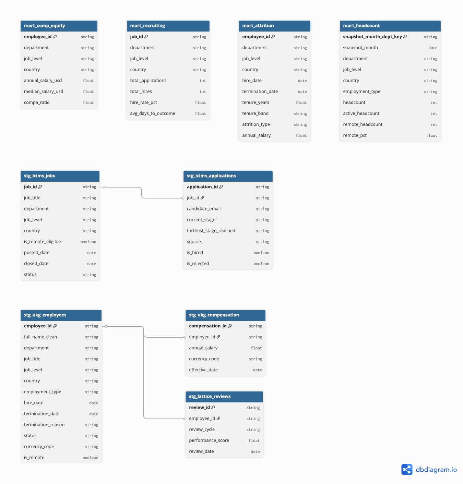
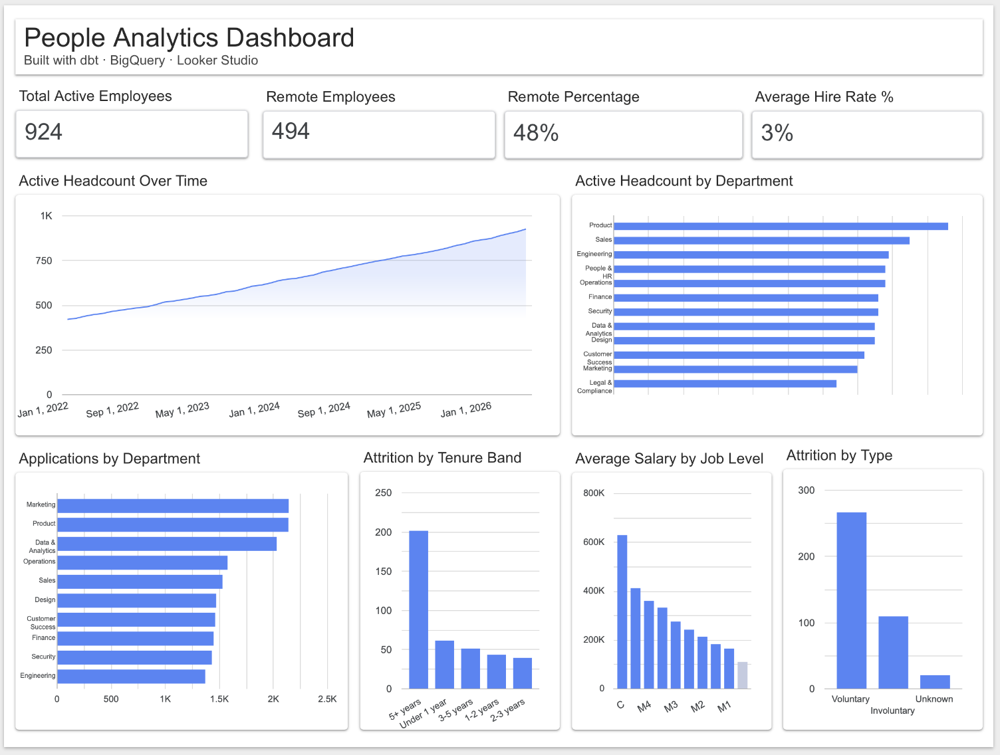

# HR Analytics dbt Project

A production-grade Analytics Engineering portfolio project modeling a multi-country HR dataset across four analytics domains: headcount, attrition, recruiting, and compensation equity.

Built to mirror the internal people analytics problems faced by globally distributed companies like Deel, Remote.com, and GitLab.

---

## Project Overview

**Stack:** dbt Cloud · BigQuery · GitHub Actions · Looker Studio  
**Domain:** HR & People Analytics  
**Data sources modeled:** UKG Pro (HRIS) · iCIMS (ATS) · Lattice (Performance)  
**Dataset:** Synthetic multi-table HR data (~38K rows) with intentional data quality issues mirroring real-world exports  

---

## Data Model Architecture

```
raw layer (BigQuery — source CSVs)
    → staging layer (stg_* — clean, rename, cast, normalize)
        → intermediate layer (int_* — business logic, joins, enrichment)
            → mart layer (mart_* — analytics-ready tables)
```




### Marts

| Mart | Business Question | Key Metrics |
|------|------------------|-------------|
| `mart_headcount` | How is our workforce growing over time? | Active headcount, remote %, headcount by dept/country |
| `mart_attrition` | Who is leaving and why? | Voluntary vs involuntary, tenure bands, attrition by dept |
| `mart_recruiting` | How efficient is our hiring funnel? | Applications, hire rate %, time to fill |
| `mart_comp_equity` | Are we paying people fairly? | Compa-ratio, salary bands by job level, pay distribution |

---

## Key Engineering Features

- **Multi-source joins** — employees, compensation, recruiting, and performance data modeled across 3 source systems
- **Incremental model** — `mart_headcount` uses dbt incremental materialization for efficient monthly snapshots
- **Data quality tests** — `not_null`, `unique`, and `accepted_values` tests across all staging and mart models
- **CI/CD** — GitHub Actions runs `dbt build` on every pull request, blocking merges on test failures
- **Department normalization** — 47 raw department name variants normalized to 12 standard values in the staging layer
- **Multi-currency compensation** — salaries normalized to USD across multiple source currencies for cross-country comp analysis

---

## Project Structure

```
models/
├── staging/          # Source cleanup: rename, cast, normalize
│   ├── stg_ukg_employees.sql
│   ├── stg_ukg_compensation.sql
│   ├── stg_ukg_employment_history.sql
│   ├── stg_ukg_time_off.sql
│   ├── stg_icims_jobs.sql
│   ├── stg_icims_applications.sql
│   └── stg_lattice_reviews.sql
├── intermediate/     # Business logic: joins, enrichment, calculations
│   ├── int_employees_enriched.sql
│   ├── int_employee_attrition.sql
│   ├── int_headcount_daily.sql
│   ├── int_compensation_normalized.sql
│   └── int_recruiting_pipeline.sql
└── marts/            # Analytics-ready tables
    ├── mart_headcount.sql
    ├── mart_attrition.sql
    ├── mart_recruiting.sql
    └── mart_comp_equity.sql
```

---

## Data Quality

This dataset was intentionally built with real-world data quality issues including:

- Mixed date formats across source systems
- Inconsistent department naming (47 variants → 12 standard values)
- Multi-currency compensation requiring normalization
- Orphaned records and mismatched IDs across systems
- Salary stored as string in a minority of rows

All issues are handled in the staging layer so downstream models start from a clean, consistent base.

---

## Dashboard


Live Looker Studio dashboard connected to BigQuery marts:  
[View Dashboard](https://datastudio.google.com/s/saLR98d7tcg)


- Active headcount over time
- Headcount by department (current snapshot)
- Remote workforce metrics
- Attrition by type and tenure band
- Applications by department
- Average salary by job level





---

**dbt Documentation:** [View Data Lineage & Model Docs](https://data-josh.github.io/hr-analytics-dbt/)

---

## Author

Josh — USMC veteran · HR Data Analyst II · Analytics Engineering portfolio project  
[LinkedIn](https://linkedin.com/in/joshua-lao) · [GitHub](https://github.com/data-josh)
